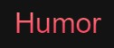

  

<h1 align="center">WebSite Humor</h1> 

WebSite so que com o JavaScript aplicado

Tabela de conteúdos
=================
<!--ts-->
   * [Sobre](#Sobre)
   * [Tabela de Conteudo](#tabela-de-conteudo)
   * [Instalação](#instalacao)
   * [Como usar](#como-usar)
      * [Pre Requisitos](#pre-requisitos)
   * [Tecnologias](#tecnologias)
<!--te-->

<h4 align="center"> 
	✔️  Pronto  ✔️
</h4>

## Sobre

 É um projeto para a contrução de um WebSite com o JavaScript

## Tabela de conteudo

- [x] Tela Inicial
- [x] Navbar

## Instalação

 Para instalar esse repositorio basta seguir os seguintes passos

1) Digite em seu terminal 
   
   <code>git clone https://github.com/Taunt-byte/WebSite-de-Hotel.git</code>

2) Depois basta abrir a pasta em seu editor de codigo

## Como usar

 Para usar basta abrir o arquivo index.html em qualquer Navegador(Edge, Firefox, etc)
 ou entrar no link abaixo:
## Pre requisitos

Para se ter proveito desse repositorio basta ter em sua maquina os seguintes itens: 
 
1) Instale o Git em sua maquina 
2) Instale uma IDE (Recomendo o VScode)  

## Tecnologias

 <table>
    <tr>
    <td>HTML</td>
    <td>CSS</td>
    <td>JavaScript</td>
    </tr>
    <tr>
    <td>5.*.*</td>
    <td>3.*.*</td>
    <td>-</td>
    </tr>
</table>
